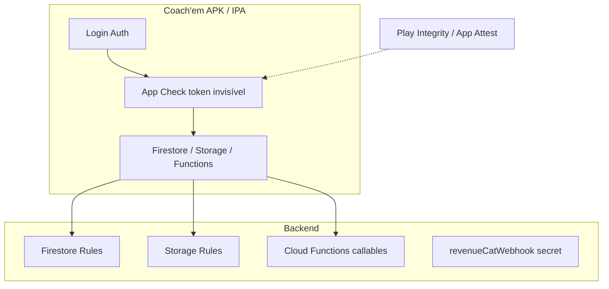

# Guia de segurança Coach'em — App Check (Android + iOS) + hardening

> **Objetivo:** Plano completo para deixar o Coach'em o mais seguro possível antes e durante o crescimento na loja.  
> **Referência:** `EletroNovo/docs/GUIA-SEGURANCA-FIREBASE-COMPLETO.md` (v6core) — adaptado **sem Web** e **sem reCAPTCHA**.  
> **Projeto Firebase:** `futeba-96395` · **Branch sugerida:** `feat/security-app-check`  
> **Última atualização:** maio/2026

---

## Índice

1. [O que vamos fazer (e o que NÃO)](#1-o-que-vamos-fazer-e-o-que-não)
2. [Estado atual do Coach'em](#2-estado-atual-do-coachem)
3. [Visão das camadas de segurança](#3-visão-das-camadas-de-segurança)
4. [Papéis: o que fazes tu vs o que fazemos no código](#4-papéis-o-que-fazes-tu-vs-o-que-fazemos-no-código)
5. [Fase 0 — Amanhã: registrar apps Android e iOS no Firebase](#5-fase-0--amanhã-registrar-apps-android-e-ios-no-firebase)
6. [Fase 1 — App Check no Console (Android + iOS)](#6-fase-1--app-check-no-console-android--ios)
7. [Fase 2 — Código: App Check nativo no app](#7-fase-2--código-app-check-nativo-no-app)
8. [Fase 3 — EAS Build, secrets e testes em dispositivo](#8-fase-3--eas-build-secrets-e-testes-em-dispositivo)
9. [Fase 4 — Métricas e validação (Enforcement OFF)](#9-fase-4--métricas-e-validação-enforcement-off)
10. [Fase 5 — Cloud Functions (anti-abuso + App Check)](#10-fase-5--cloud-functions-anti-abuso--app-check)
11. [Fase 6 — Firestore e Storage (auditoria P0)](#11-fase-6--firestore-e-storage-auditoria-p0)
12. [Fase 7 — Enforcement no Console (ligar o interruptor)](#12-fase-7--enforcement-no-console-ligar-o-interruptor)
13. [Fase 8 — P1 recomendado (pós go-live)](#13-fase-8--p1-recomendado-pós-go-live)
14. [Cronograma sugerido (~2 h/dia)](#14-cronograma-sugerido-2-hdia)
15. [Checklist mestre (copiar e marcar)](#15-checklist-mestre-copiar-e-marcar)
16. [Problemas comuns](#16-problemas-comuns)
17. [Relação com Pro+ Health e outros docs](#17-relação-com-pro-health-e-outros-docs)

---

## 1. O que vamos fazer (e o que NÃO)

### Fazemos

| Item | Descrição |
|------|-----------|
| **Apps Firebase Android + iOS** | Registrar com package/bundle `com.vision10.coachem` (hoje só existe app **Web** `coachemApp` no projeto — padrão Expo, mas o mobile usa IDs nativos). |
| **Firebase App Check** | Play Integrity (Android) + DeviceCheck / App Attest (iOS). |
| **Debug tokens** | Dev, preview e testes internos antes do Integrity “perfeito”. |
| **Código nativo** | Inicializar App Check após `initializeApp` (padrão v6: `@react-native-firebase/app-check`). |
| **EAS builds** | Testar em APK/AAB/IPA reais — **não** Expo Go para validar App Check. |
| **Functions** | Rate limit + `enforceAppCheck` nas callables sensíveis (quando métricas OK). |
| **Rules** | Manter `firestore.rules` / `storage.rules` versionados; deploy alinhado ao repo. |

### NÃO fazemos neste plano

| Item | Motivo |
|------|--------|
| **App Check Web / reCAPTCHA v3** | Coach'em **não usa web** em produção. |
| **reCAPTCHA v2 + `verifyRecaptcha`** | Só para login em browser; não aplicável. |
| **Novo app Web no Firebase** | O `coachemApp` (Web) pode **ficar** no projeto — não atrapalha; simplesmente ignoramos App Check nele. |
| **Enforcement no dia 1** | Igual v6: primeiro métricas **> 90% verified**, depois ligar produto a produto. |

---

## 2. Estado atual do Coach'em

| Área | Status |
|------|--------|
| Firebase projeto | `futeba-96395` (`.firebaserc`) |
| App no Console (teu print) | Só **Web** `coachemApp` — falta **Android** e **iOS** |
| SDK no app | Firebase **JS modular** (`src/services/firebase.config.ts`) |
| `google-services.json` / `GoogleService-Info.plist` | **Ainda não** no repositório |
| App Check código | **Não implementado** |
| Firestore rules | **Avançadas** (`firestore.rules` — Coach'em + CooPs + `health`) |
| Storage rules | Parcial (`profilePhotos`, `exercises`; CooPs `rooms`) |
| Callables | `createAthleteByCoach`, `sendPasswordResetEmailTreina`, `sendEmailVerificationTreina` |
| Webhook | `revenueCatWebhook` (HTTP — **não** usa App Check; usa secret RevenueCat) |
| Scheduler | `dispatchAthleteWorkoutPushReminders` |
| Aceite legal atleta | `athlete-legal-acceptance` |
| Plano Pro/grátis | `planLimits.service.ts` + Firestore `subscriptionTier` |
| Checklist interno | `SEGURANCA_LANCAMENTO_CHECKLIST.md` (P0/P1) |

**Package / bundle (app.json):**

- Android: `com.vision10.coachem`
- iOS: `com.vision10.coachem`

---

## 3. Visão das camadas de segurança



| Camada | Protege contra |
|--------|----------------|
| **App Check** | Scripts com API key, clones, Postman sem app oficial |
| **Firestore rules** | Utilizador A ler/escrever dados do utilizador B |
| **Storage rules** | Upload/leitura indevida de ficheiros |
| **Functions + rate limit** | Spam de email reset / criar atleta / verificação |
| **Auth + email verification** | Contas sem confirmar (já no fluxo) |

---

## 4. Papéis: o que fazes tu vs o que fazemos no código

| Tarefa | Quem | Onde |
|--------|------|------|
| Criar app **Android** e **iOS** no Firebase Console | **Tu** | Project settings → Seus aplicativos → Adicionar aplicativo |
| Baixar `google-services.json` e `GoogleService-Info.plist` | **Tu** | Mesma página → colocar na **raiz** do repo (não commitar se política de segredos — ou commitar se v6 faz assim) |
| Registrar App Check Android/iOS | **Tu** | Build → App Check |
| SHA-256 EAS no app Android | **Tu** | `eas credentials -p android` → colar no Firebase |
| DeviceCheck / App Attest (.p8 Apple) | **Tu** | Apple Developer + Firebase App Check iOS |
| Debug tokens App Check | **Tu** | Console → Manage debug tokens |
| Secrets EAS (`EXPO_PUBLIC_*`, debug token) | **Tu** | expo.dev → projeto Coach'em |
| Play Console (teste interno/fechado) | **Tu** | Já em curso — ajuda Play Integrity |
| Código App Check + plugins Expo | **Nós (IA + tu)** | Branch `feat/security-app-check` |
| `.env.example` atualizado | **Nós** | Repo |
| `enforceAppCheck` nas Functions | **Nós** | `functions/src/index.ts` |
| Deploy rules / functions | **Tu** (comando) ou pedir à IA | `firebase deploy --only …` |
| Enforcement Console | **Tu** | Só após Fase 4 OK |

---

## 5. Fase 0 — Amanhã: registrar apps Android e iOS no Firebase

**Tempo:** ~30–45 min · **Risco para produção:** zero (só adiciona apps ao projeto).

### 5.1 Android

1. Firebase Console → **Configurações do projeto** → **Seus aplicativos** → **Adicionar aplicativo** → **Android**.
2. Nome do pacote Android: `com.vision10.coachem` (igual `app.json`).
3. Apelido sugerido: `Coach'em Android`.
4. (Opcional) SHA-1 debug — podes adicionar depois com EAS.
5. **Registrar app** → transferir **`google-services.json`** → guardar em `Coach-em/google-services.json`.
6. Anotar o **App ID** Android (formato `1:470404253728:android:…`) — não confundir com o Web `coachemApp`.

### 5.2 iOS

1. **Adicionar aplicativo** → **iOS**.
2. ID do pacote: `com.vision10.coachem`.
3. Apelido: `Coach'em iOS`.
4. **Registrar** → transferir **`GoogleService-Info.plist`** → `Coach-em/GoogleService-Info.plist`.
5. Anotar **App ID** iOS.

### 5.3 O app Web `coachemApp`

- **Não apagar** — outras partes do monorepo Firebase (CooPs, Futeba Web) podem usar o mesmo projeto.
- O `.env` atual pode continuar com `EXPO_PUBLIC_FIREBASE_APP_ID` do **Web** até decidirmos:
  - **Opção A (recomendada para App Check):** usar variáveis separadas por plataforma no EAS (`google-services` liga ao app Android/iOS nativo).
  - **Opção B:** trocar `EXPO_PUBLIC_FIREBASE_APP_ID` no build mobile para o ID **Android/iOS** — documentar no EAS por ambiente.

> **Decisão na Fase 2:** ao integrar RN Firebase, o `google-services.json` define o app Android; o SDK web `appId` no `.env` deve estar **coerente** com o build (evitar misturar Web ID em build nativo).

### 5.4 Checklist Fase 0

- [ ] App Android criado no Console
- [ ] App iOS criado no Console
- [ ] `google-services.json` na raiz do projeto
- [ ] `GoogleService-Info.plist` na raiz do projeto
- [ ] App IDs anotados num sítio seguro (Notion / doc interno)

---

## 6. Fase 1 — App Check no Console (Android + iOS)

**Tempo:** ~45–60 min · **Enforcement:** manter **OFF**.

### 6.1 Abrir App Check

1. Console → **Build** → **App Check** → aba **Apps**.
2. Deves ver **3 apps** (Web + Android + iOS). Só configuramos **Android** e **iOS**.

### 6.2 Android — Play Integrity

1. App **Android** `com.vision10.coachem` → **Register** / configurar.
2. Provedor: **Play Integrity** → Save.
3. **Project settings** → app Android → **SHA certificate fingerprints**:
   ```bash
   eas credentials -p android
   ```
   Perfil **production** (e **preview** se testares APK interno) → copiar **SHA-256** → colar no Firebase.

### 6.3 iOS — DeviceCheck + App Attest

1. [Apple Developer](https://developer.apple.com) → Identifiers → App ID `com.vision10.coachem` → ativar **DeviceCheck** (e capacidades necessárias).
2. Criar chave **DeviceCheck** (.p8) se ainda não existir.
3. Firebase → App Check → app **iOS** → **DeviceCheck** (Team ID, Key ID, upload `.p8`).
4. Registar **App Attest** no mesmo app quando o Console oferecer.

### 6.4 Debug tokens (obrigatório para dev/preview)

1. App Check → **Manage debug tokens** → **Add debug token**.
2. Criar um token para equipa dev (UUID).
3. Guardar para `.env` e EAS:
   ```env
   EXPO_PUBLIC_APP_CHECK_DEBUG_TOKEN=uuid-do-console
   ```
4. Repetir mentalidade v6: em **preview/development** o código usa provedor **debug**; em **production** usa Integrity / App Attest.

### 6.5 Checklist Fase 1

- [ ] Android registado em App Check (Play Integrity)
- [ ] SHA-256 production (e preview se aplicável) no Firebase
- [ ] iOS registado (DeviceCheck + App Attest)
- [ ] Debug token criado e guardado
- [ ] **Enforcement** em Firestore / Auth / Storage / Functions = **OFF**

---

## 7. Fase 2 — Código: App Check nativo no app

**Tempo:** ~2–3 sessões de 2 h · **Requer:** ficheiros da Fase 0 + branch dedicada.

> **Nota técnica:** O Coach'em usa hoje o Firebase **JS SDK**. App Check em mobile com Play Integrity / App Attest exige módulo **nativo**, como no v6. Caminho alinhado ao EletroNovo:

### 7.1 Dependências (planeado)

```bash
npx expo install @react-native-firebase/app @react-native-firebase/app-check
```

### 7.2 Plugins Expo (`app.json` ou `app.config`)

Adicionar (equivalente v6):

```json
"@react-native-firebase/app",
"@react-native-firebase/app-check"
```

Referenciar:

- `android.googleServicesFile`: `./google-services.json`
- `ios.googleServicesFile`: `./GoogleService-Info.plist`

### 7.3 Ficheiros novos (planeado)

| Ficheiro | Função |
|----------|--------|
| `src/services/appCheck.native.ts` | Play Integrity / App Attest / debug |
| `src/services/appCheck.ts` | Re-export; web = no-op (Coach'em sem web) |
| Alterar `src/services/firebase.config.ts` | Chamar `initAppCheck()` após `initializeApp`, com `try/catch` (não bloquear boot) |

Lógica debug (igual v6):

- `__DEV__` ou `EXPO_PUBLIC_ENVIRONMENT=preview` → provider **debug** + `EXPO_PUBLIC_APP_CHECK_DEBUG_TOKEN`
- `production` → Play Integrity / `appAttestWithDeviceCheckFallback`

### 7.4 Variáveis `.env.example` (atualizar)

```env
# App Check (mobile) — token de debug do Console (Fase 1)
EXPO_PUBLIC_APP_CHECK_DEBUG_TOKEN=

# Opcional: forçar ambiente para appCheck.native.ts
# EXPO_PUBLIC_ENVIRONMENT=preview
```

**Não adicionar** `EXPO_PUBLIC_RECAPTCHA_*` nem `EXPO_PUBLIC_APP_CHECK_RECAPTCHA_SITE_KEY` (sem web).

### 7.5 Ordem de boot (crítico)

1. `initializeApp(firebaseConfig)`
2. `initAppCheck()` — warn se falhar, app continua (igual v6)
3. `initializeAuth` / Firestore / Storage / Functions

### 7.6 Checklist Fase 2

- [ ] Branch `feat/security-app-check` criada
- [ ] Pacotes RN Firebase instalados
- [ ] Plugins e `google-services` / plist no config
- [ ] `initAppCheck` integrado
- [ ] `.env.example` atualizado
- [ ] `npx tsc --noEmit` sem erros
- [ ] Commit: `feat(security): initialize app check native [Phase 2]`

---

## 8. Fase 3 — EAS Build, secrets e testes em dispositivo

**Tempo:** ~1 sessão + tempo de build na nuvem.

### 8.1 Secrets no expo.dev

Além das `EXPO_PUBLIC_FIREBASE_*` existentes:

| Secret | Perfil |
|--------|--------|
| `EXPO_PUBLIC_APP_CHECK_DEBUG_TOKEN` | development, preview |
| (opcional) `EXPO_PUBLIC_ENVIRONMENT=preview` | preview |

Production **não** precisa debug token no cliente final.

### 8.2 Builds

```bash
eas build --platform android --profile preview
eas build --platform ios --profile preview
```

Ou **production** quando validares teste fechado Play.

### 8.3 Testes manuais (dispositivo físico)

| Fluxo | Android | iOS |
|-------|---------|-----|
| Login treinador | ☐ | ☐ |
| Login atleta | ☐ | ☐ |
| Listar treinos / Firestore read | ☐ | ☐ |
| Atribuir treino (coach) | ☐ | ☐ |
| Upload foto perfil (Storage) | ☐ | ☐ |
| Esqueci senha (callable) | ☐ | ☐ |
| Criar atleta com login (callable) | ☐ | ☐ |

### 8.4 Checklist Fase 3

- [ ] Secrets EAS configurados
- [ ] APK/AAB instalado em Android físico
- [ ] IPA/TestFlight em iOS (quando disponível)
- [ ] Fluxos críticos OK com App Check **sem** Enforcement

---

## 9. Fase 4 — Métricas e validação (Enforcement OFF)

**Tempo:** 24–48 h de uso real + testes.

1. Console → **App Check** → selecionar app **Android** → gráfico **Verified / Unverified**.
2. Repetir para **iOS**.
3. **Meta (v6):** **> 90% verified** antes de qualquer Enforcement.
4. Se Android **unverified** alto:
   - Confirmar SHA-256
   - Preview com **debug token**
   - APK de teste interno Play (melhora Integrity)

### Checklist Fase 4

- [ ] Android > 90% verified (48 h)
- [ ] iOS > 90% verified (48 h) ou plano iOS posterior
- [ ] Documentar % final no fim deste doc ou issue

---

## 10. Fase 5 — Cloud Functions (anti-abuso + App Check)

**Tempo:** ~2 sessões · **Deploy:** só quando Fase 4 OK.

### 10.1 Callables a proteger

| Function | App Check depois | Rate limit |
|----------|------------------|------------|
| `createAthleteByCoach` | Sim | Já tem padrão email — rever limites |
| `sendPasswordResetEmailTreina` | Sim | IP/email/UID + cooldown |
| `sendEmailVerificationTreina` | Sim | Idem |

### 10.2 NÃO exigir App Check

| Function | Motivo |
|----------|--------|
| `revenueCatWebhook` | HTTP com Authorization RevenueCat / Admin |
| `dispatchAthleteWorkoutPushReminders` | Scheduler interno |

### 10.3 Código (planeado)

Firebase Functions v2:

```typescript
export const sendPasswordResetEmailTreina = onCall(
  { enforceAppCheck: true, /* + região/secrets existentes */ },
  async (request) => { ... }
);
```

**Ordem:** deploy com `enforceAppCheck: false` primeiro → testar → ligar `true` → deploy.

### 10.4 Checklist Fase 5

- [ ] Rate limits documentados e testados
- [ ] `enforceAppCheck: true` nas 3 callables
- [ ] `firebase deploy --only functions:…`
- [ ] Teste: app **sem** token App Check deve falhar nas callables (após enforcement cliente + function)

---

## 11. Fase 6 — Firestore e Storage (auditoria P0)

Muita coisa **já está** em `firestore.rules`. Esta fase é **revisão**, não reescrever do zero.

### 11.1 Firestore (do `SEGURANCA_LANCAMENTO_CHECKLIST.md`)

- [ ] Confirmar `coachemAssignedWorkouts` — atleta só patch em campos permitidos
- [ ] Confirmar `coachemAthletes` — vínculo `coachId`
- [ ] Subcoleção `health` — já adicionada (Dia 7 Health)
- [ ] `users` — billing (`subscriptionTier`) imutável pelo cliente
- [ ] Deploy: `firebase deploy --only firestore:rules` (repo = Console)

### 11.2 Storage

- [ ] `profilePhotos/{userId}` — write só dono (OK)
- [ ] `exercises/{exerciseId}` — write `request.auth != null` — **avaliar** restringir a coach dono do exercício
- [ ] App Check em Storage só na **Fase 7**

### 11.3 Checklist Fase 6

- [ ] Diff rules vs produção (sem drift)
- [ ] Ajustes mínimos se auditoria encontrar buraco
- [ ] Commit: `chore(rules): storage tighten` (se necessário)

---

## 12. Fase 7 — Enforcement no Console (ligar o interruptor)

**Só após Fase 4 + 5.** Um produto por dia; testar entre cada.

| Ordem | Produto | Motivo |
|-------|---------|--------|
| 1 | **Cloud Storage** | Menos tráfego crítico que Firestore |
| 2 | **Cloud Firestore** | Core do app |
| 3 | **Authentication** | Login |
| 4 | **Cloud Functions** (callables) | Já com `enforceAppCheck` no código |

Se quebrar testers: **desligar só aquele produto**, corrigir debug token/build, repetir.

### Checklist Fase 7

- [ ] Storage Enforcement ON — testado
- [ ] Firestore Enforcement ON — testado
- [ ] Auth Enforcement ON — testado
- [ ] Functions Enforcement ON — testado

---

## 13. Fase 8 — P1 recomendado (pós go-live)

Do `SEGURANCA_LANCAMENTO_CHECKLIST.md`:

| # | Item |
|---|------|
| 5 | Sentry / Crashlytics + alertas |
| 6 | Higiene de logs (sem PII) |
| 7 | Revisar permissões Android (`RECORD_AUDIO`, etc.) |
| 8 | Checkbox Termos no **cadastro coach** (atleta já tem legal acceptance) |
| 9–10 | Docs jurídicos + processo LGPD interno |

---

## 14. Cronograma sugerido (~2 h/dia)

| Dia | Fase | Entrega |
|-----|------|---------|
| **D1** | 0 + 1 | Apps Android/iOS no Firebase + App Check Console + SHA + debug token |
| **D2** | 2 (parte 1) | Dependências + plugins + ficheiros appCheck |
| **D3** | 2 (parte 2) | Integração `firebase.config` + TS + commit |
| **D4** | 3 | EAS secrets + build Android preview + teste físico |
| **D5** | 3–4 | Build iOS (se possível) + olhar métricas Console |
| **D6–D7** | 4 | Esperar / usar app; meta 90% verified |
| **D8** | 5 | Rate limit + `enforceAppCheck` callables |
| **D9** | 6 | Auditoria Storage + deploy rules |
| **D10+** | 7 | Enforcement gradual (1 produto/dia) |

**Paralelo:** Pro+ Health (`HEALTH_PHASE_1.md` Dia 9+) pode continuar **depois** de D3 ou em branch separada — não conflita, mas **build EAS** pode ser partilhado (um build com Health + App Check).

---

## 15. Checklist mestre (copiar e marcar)

### Console Firebase

- [ ] App Android `com.vision10.coachem` criado
- [ ] App iOS `com.vision10.coachem` criado
- [ ] `google-services.json` + `GoogleService-Info.plist` no projeto
- [ ] App Check Android — Play Integrity
- [ ] App Check iOS — DeviceCheck + App Attest
- [ ] SHA-256 EAS no Firebase Android
- [ ] Debug token criado
- [ ] Enforcement **OFF** em todos os produtos

### Repositório / EAS

- [ ] Branch `feat/security-app-check`
- [ ] RN Firebase App Check integrado
- [ ] `.env` + EAS secrets com debug token
- [ ] Build preview/production testado em físico
- [ ] Métricas > 90% verified (Android e iOS)

### Backend

- [ ] Callables com rate limit reforçado
- [ ] `enforceAppCheck: true` nas 3 callables
- [ ] Rules Firestore/Storage alinhadas ao repo
- [ ] Enforcement Console ligado por fases

### Jurídico / produto (P1)

- [ ] Checkbox coach no registro (se ainda faltar)
- [ ] Sentry/observabilidade
- [ ] Permissões Android minimizadas

---

## 16. Problemas comuns

| Sintoma | Causa provável | Solução |
|---------|----------------|---------|
| Android 0% verified | Expo Go ou SHA errado | EAS APK + SHA-256 no Firebase |
| Preview APK unverified | Sideload sem Play Integrity | Debug provider + debug token |
| iOS build falha | Sem `GoogleService-Info.plist` | Fase 0 — baixar do Firebase |
| App funciona mas callable falha | `enforceAppCheck` ligado cedo | Desligar na function; corrigir cliente |
| Firestore permission denied após Enforcement | Cliente sem token | App Check init + rebuild |
| Confusão Web appId | `.env` com ID Web em build nativo | Usar app Android/iOS via `google-services` |

---

## 17. Relação com Pro+ Health e outros docs

| Documento | Relação |
|-----------|---------|
| `HEALTH_INTEGRATION_PLAN.md` | Feature à parte; mesmo build nativo eventual |
| `HEALTH_PHASE_1.md` | Dia 4 Dev Client pode **unificar** com security build |
| `SEGURANCA_LANCAMENTO_CHECKLIST.md` | P0/P1 — Fases 6 e 8 deste guia |
| `EletroNovo/.../GUIA-SEGURANCA-FIREBASE-COMPLETO.md` | Referência completa (web + captcha) |
| `docs/EMAIL_PASSWORD_RESET.md` | Callables afetadas na Fase 5 |
| `docs/MONETIZACAO.md` | `revenueCatWebhook` sem App Check |

---

## Frase para amanhã (Dia 1)

> Criar apps **Android** e **iOS** no Firebase (`com.vision10.coachem`), baixar `google-services.json` e `GoogleService-Info.plist`, registar **App Check** (Play Integrity + DeviceCheck/App Attest), colar **SHA-256** do EAS e criar **debug token** — tudo com **Enforcement OFF**. Depois implementamos o código nativo numa branch dedicada.

---

*Plano criado para execução conjunta Vision10 / Coach'em. Atualizar checklists à medida que cada fase for concluída.*
