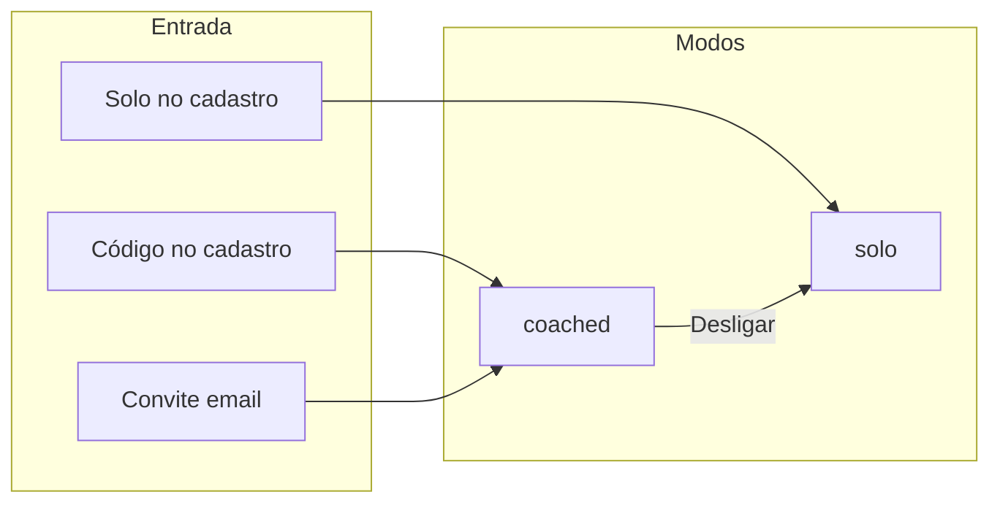

# Roadmap — Coach'em para treinadores e atletas (solo + com coach)

**Documento mestre de produto** — tudo o que foi acordado em conversa de alinhamento.  
**Status:** **P1 ✅** · **P2** (deploy OK; **rules Console** + testes manuais pendentes) · **P3 parcial** · **P4 em código** (deploy `unlinkAthleteFromCoach` pendente) · **P6 parcial** (UI convite) · **P5** por fazer.  
**Última atualização:** 2026-05-29  
**Acompanhar evolução:** secção [15. Checklist de implementação](#15-checklist-de-implementação) (checkboxes abaixo).  

**Relacionado:** [`MONETIZACAO.md`](./MONETIZACAO.md) · [`COACHEM_FIRESTORE_COLECOES.md`](./COACHEM_FIRESTORE_COLECOES.md) · [`HEALTH_PHASE_1.md`](./HEALTH_PHASE_1.md) (paralelo, independente)

---

## Índice

1. [Visão e público](#1-visão-e-público)  
2. [Princípio: organizar, não reescrever](#2-princípio-organizar-não-reescrever)  
3. [Modelo de utilizador](#3-modelo-de-utilizador)  
4. [Vínculo atleta ↔ treinador](#4-vínculo-atleta--treinador)  
5. [Monetização](#5-monetização)  
6. [Período de graça ao desvincular](#6-período-de-graça-ao-desvincular)  
7. [UX — abas, Início e Treinos](#7-ux--abas-início-e-treinos)  
8. [Coached + Athlete Pro (treinos extras)](#8-coached--athlete-pro-treinos-extras)  
9. [Firestore — matriz de autorização](#9-firestore--matriz-de-autorização)  
10. [Dados e backend (resumo)](#10-dados-e-backend-resumo)  
11. [Fases de implementação](#11-fases-de-implementação)  
12. [Checklist de decisões fechadas](#12-checklist-de-decisões-fechadas)  
13. [Aberto / comercial](#13-aberto--comercial)  
14. [Histórico de revisões](#14-histórico-de-revisões)  
15. [Checklist de implementação](#15-checklist-de-implementação)

---

## 1. Visão e público

### Porquê expandir

O Coach'em deixa de ser **só** ferramenta para treinadores. Passa a servir também **qualquer atleta** que queira **organização** (treinos, histórico, gráficos, calendário, opcionalmente wearables) — com ou sem personal trainer.

### Dois públicos, um app

| Público | Proposta de valor |
|---------|-------------------|
| **Treinador** | Gere atletas, biblioteca, templates, atribuição, relatórios, plano **Coach Pro**. |
| **Atleta solo** | É o seu próprio “treinador” no app — biblioteca, meus treinos, calendário, progresso — plano **Athlete Pro** para o completo. |
| **Atleta com coach** | App **grátis** para seguir o PT; treinos + wearables se o **coach** tiver Pro; **treinos extras** próprios só com **Athlete Pro** (anti-abuso). |

### Frases de produto

- **Treinador:** “Acompanha a tua equipa num só sítio.”  
- **Atleta solo:** “Organiza os teus treinos e vê a tua evolução.”  
- **Atleta com coach:** “Segue o plano do teu treinador.”  
- **Upsell coached:** “Queres montar treinos teus também? **Athlete Pro.**”

---

## 2. Princípio: organizar, não reescrever

O escopo **aumenta**, mas a base técnica **mantém-se**:

| Já existe (reutilizar) | O que muda (organizar) |
|------------------------|-------------------------|
| `exercises-library`, `workouts-library`, `assign-workout`, `workout-details` | **Quem** vê os botões e **quem** pode criar (solo / coached / Pro) |
| Home atleta com KPIs, gráficos carga/intervalado/frequência | Topo com **foto + nome**; coached mantém card do PT |
| Aba **Treinos** com calendário, próximos, histórico | + 3 botões (biblioteca, meus treinos, adicionar treino) quando permitido |
| Dashboard coach, lista atletas, convites (a construir) | Coach **não cria** conta do atleta; código + email |
| `coachemAssignedWorkouts`, templates, exercises | Dois tipos de atribuição: `coachId` = PT **ou** `coachId` = self (atleta Pro) |
| RevenueCat / `subscriptionTier` no coach | Segundo produto **Athlete Pro** + webhook |
| Firestore rules (coach-centric hoje) | Novos ramos + matriz (secção 9) — **planejar antes de codar** |

**Não** é um app novo. É **regras de negócio + UI condicional + rules/Functions** em cima do que já funciona.

---

## 3. Modelo de utilizador

### 3.1 Dois tipos (`users.userType`)

| Valor | Papel |
|-------|--------|
| `COACH` | Treinador |
| `ATHLETE` | Atleta (solo ou com coach) |

**Sem** terceiro tipo de login.

### 3.2 Modo do atleta (`users.athleteMode`)

| Valor | `coachId` | Significado |
|-------|-----------|-------------|
| `solo` | `null` | Organiza e treina por conta própria |
| `coached` | UID do PT | Segue treinador vinculado |

### 3.3 Matriz de capacidades (resumo)

| Capacidade | Solo (free) | Solo + **Athlete Pro** | Coached (free) | Coached + **Athlete Pro** |
|------------|-------------|------------------------|----------------|---------------------------|
| Treinos do **coach** | — | — | Sim (se coach Pro) | Sim |
| Treinos **próprios** (criar/atribuir) | Limitado free | Sim | Não | Sim |
| Biblioteca + templates | Limitado | Sim | Não | Sim |
| Wearables / Health | Não | Sim | Sim se **coach** Pro | Sim (coach Pro e/ou Athlete Pro) |
| Desligar do coach | — | — | Sim → `solo` | Sim → `solo` |

---

## 4. Vínculo atleta ↔ treinador

### 4.1 Treinador **não cria** a conta do atleta (fluxo principal)

- **Descontinuar** `createAthleteByCoach` (email + senha provisória) como caminho principal.
- O PT combina com o atleta **fora do app** e usa **código** ou **convite email**.

### 4.2 Cadastro **novo** — código do treinador

1. Atleta escolhe “Tenho treinador” e introduz código (ex. `COACH-7K3M`).  
2. Registo normal (nome, email, senha) → **só** email de confirmação.  
3. Após confirmar: `athleteMode: coached`, `coachId` definido, `coachemAthletes` criado.  
4. Código no signup = consentimento inicial (copy legal).

**Dados:** `users/{coachUid}.inviteCode` (único, regenerável).

### 4.3 Conta **já existente** — convite por email

1. Coach: “Convidar atleta” → email.  
2. Coleção `coachInvites` (pending / accepted / rejected).  
3. Atleta: **Aceitar** ou **Recusar** no app.  
4. Se aceitar → `coached` + `coachId`.

### 4.4 Solo que liga depois

Perfil → **“Ligar treinador”** (código ou convite pendente).

### 4.5 Desligar do treinador

- `athleteMode` → `solo`, `coachId` → `null`.  
- Sem **novos** treinos do coach.  
- Histórico e concluídos **mantêm-se**.  
- Pendentes do coach: **30 dias** de graça (secção 6).



---

## 5. Monetização

### 5.1 Coach Pro (como hoje)

- Limites de atletas, biblioteca, atribuição, relatórios.  
- Enquanto ativo: atletas **coached** recebem treinos atribuídos + wearables (no vínculo).

### 5.2 Atleta com coach — app grátis (base)

| Incluído grátis | Não incluído |
|-----------------|--------------|
| Executar treinos do PT | Criar biblioteca / templates / treinos próprios |
| Wearables se **coach** Pro | Athlete Pro “empréstimo” para amigos |

### 5.3 Atleta solo — Athlete Pro

- Biblioteca, meus treinos, adicionar treino, gráficos completos, wearables.  
- Free: limites em `src/constants/freePlan.ts`.

### 5.4 Coached + Athlete Pro (extras)

- Mesmos 3 botões na aba **Treinos** que o solo Pro.  
- Treinos **extra**: `coachId` no documento = **UID do atleta** (auto-gestão).  
- Treinos do PT: `coachId` = UID do treinador.  
- Evita “1 Coach Pro para N amigos com app completo grátis”.

### 5.5 Tabela resumo

```
                    │ Treinos do coach │ Treinos próprios │ Wearables      │ Criar biblioteca
────────────────────┼──────────────────┼──────────────────┼────────────────┼─────────────────
Coached (free)      │ Se Coach Pro     │ Não              │ Se Coach Pro   │ Não
Coached + Athlete Pro│ Se Coach Pro    │ Sim              │ Coach e/ou Athlete Pro │ Sim
Solo (free)         │ —                │ Limitado         │ Não            │ Limitado
Solo + Athlete Pro  │ —                │ Sim              │ Sim            │ Sim
```

**Wearables (regra alvo):** `canUseHealth = (coached && coachProAtivo) || athleteProAtivo`.

---

## 6. Período de graça ao desvincular

**Problema:** atleta acumula treinos do coach o ano todo e desvincula para manter Pro grátis.

| Fase | Duração | Comportamento |
|------|---------|----------------|
| Graça | **30 dias** após desvincular | Pendentes **daquele coach** ainda visíveis/executáveis |
| Depois | — | Pendentes do ex-coach bloqueados ou só leitura; atleta **free solo** até **Athlete Pro** |

**Campos conceito:** `users.coachUnlinkedAt`, `coachAccessEndsAt` por treino ou filtro por data.

---

## 7. UX — abas, Início e Treinos

### 7.1 Estrutura fixa (3 abas)

```
[ Início ]    [ Treinos ]    [ Perfil ]
```

Coach mantém: Início | **Atletas** | Perfil (sem mudança de modelo de abas do coach).

### 7.2 Aba **Início** (atleta) — progresso e identidade

**Todos os atletas (solo e coached):** topo com **foto de perfil** + **nome em destaque** (estilo card do atleta na lista do coach); logo Coach'em pequeno.

| Bloco | Solo | Coached |
|-------|------|---------|
| Card treinador | — | Nome, mensagem do PT |
| KPIs | Semana, concluídos, sequência | Igual |
| Treino do dia | Próprio | Do coach |
| Gráficos | Carga, intervalado, frequência (+ saúde se Pro) | Igual (dados dos treinos) |

**Nada** de biblioteca, adicionar treino ou calendário grande no Início.

### 7.3 Aba **Treinos** (atleta) — tudo sobre treinar

Ordem **de cima para baixo:**

1. **Biblioteca de exercícios** (botão) → `exercises-library`  
2. **Meus treinos** (botão) → `workouts-library`  
3. **Adicionar treino** (botão) → `assign-workout` (`athleteId` = próprio uid)  
4. **Calendário / agenda** (UI alinhada à agenda do treinador)  
5. **Próximos** | **Histórico**

**Quem vê os 3 botões:**

| Situação | Botões 1–3 |
|----------|------------|
| Solo + Athlete Pro | Sim |
| Solo free | Não (ou limitado + CTA Pro) |
| Coached free | **Não** |
| Coached + Athlete Pro | **Sim** (extras pagos) |

Calendário e listas: **todos** (coached vê treinos do PT; solo/Pro vê os seus + do PT se coached).

```text
┌─ INÍCIO ────────────────────────────────────┐
│  [foto]  Nome grande      [logo Coach'em]  │
│  [card coach se coached]                   │
│  KPIs | Treino do dia | Gráficos           │
└────────────────────────────────────────────┘

┌─ TREINOS ──────────────────────────────────┐
│  [ Biblioteca ] [ Meus treinos ] [ + Treino ]  ← se Pro / solo Pro / coached+Pro
│  ─── Calendário ───                        │
│  Próximos | Histórico                      │
└────────────────────────────────────────────┘
```

### 7.4 Aba **Perfil**

| Item | Coached | Solo |
|------|---------|------|
| Saúde / wearables | Sim | Sim (Pro para sync completo) |
| Plano | Via coach / opcional Athlete Pro | Athlete Pro |
| Ligar / desligar coach | Sim | Ligar (código) |

---

## 8. Coached + Athlete Pro (treinos extras)

### Distinção no Firestore

| Origem | `coachId` | `athleteId` | Criado por |
|--------|-----------|-------------|------------|
| Treinador | UID do PT | UID do atleta | Coach |
| Extra atleta (Pro) | UID do **atleta** | UID do atleta | Atleta Pro |

Campo opcional futuro: `assignmentSource: 'coach' | 'self'` (cores no calendário).

O **PT pode ler** todos os treinos do atleta (`coachOwnsAthlete`).

### Anti-abuso

Sem Athlete Pro, amigos no código do coach **só** recebem treinos do coach — não montam biblioteca grátis.

---

## 9. Firestore — matriz de autorização

**Revisão obrigatória linha a linha antes de implementar.** Hoje **só COACH** cria exercises, templates e assigned workouts.

| Recurso | Coach | Coached free | Coached + Athlete Pro | Solo free | Solo + Athlete Pro |
|---------|-------|--------------|----------------------|-----------|---------------------|
| Ler treinos do atleta | ✅ | ✅ | ✅ | ✅ | ✅ |
| Criar treino **para** atleta | ✅ | ❌ | ❌ | ❌ | ❌ |
| Criar treino **para si** (`coachId == self`) | ❌ | ❌ | ✅ | ❌ | ✅ |
| `coachemExercises` create | ✅ | ❌ | ✅ `createdBy == self` | ❌ | ✅ |
| `coachemWorkoutTemplates` create | ✅ | ❌ | ✅ `coachId == self` | ❌ | ✅ |
| Executar sessão (patch atleta) | — | ✅ | ✅ | ✅ | ✅ |
| `health` subcoleção | lê | grava* | grava* | — | grava* |

\*Gravação de health conforme `canUseHealth` (coach Pro e/ou athlete Pro).

**Helpers alvo nas rules:**

- `isAthletePro()` — `userType == ATHLETE` && `subscriptionTier == 'pro'` (webhook RevenueCat).  
- `isSelfDirectedAssignment()` — `coachId == athleteId == auth.uid`.  
- `create` assigned workout: coach **OU** (`isAthletePro()` && self).

**Billing:** webhook deve poder atualizar `subscriptionTier` em atletas; `coachEmBillingFieldsUnchanged()` só para campos RevenueCat — não bloquear athlete Pro por engano.

---

## 10. Dados e backend (resumo)

| Item | Descrição |
|------|-----------|
| `users` | `athleteMode`, `coachId`, `coachUnlinkedAt`, `inviteCode` (coach) |
| `coachInvites` | email, coachId, status, timestamps |
| Cloud Functions | `linkAthleteByCoachCode`, `sendCoachInvite`, `acceptCoachInvite`, `unlinkAthleteFromCoach`; deprecar `createAthleteByCoach` |
| RevenueCat | Produtos Coach Pro + Athlete Pro; entitlements distintos |
| App | Cadastro ramificado; gates UI; rotas existentes reutilizadas |
| Legal | Código = vínculo; desvincular; graça 30 dias |

---

## 11. Fases de implementação

| Fase | Entrega | Estado |
|------|---------|--------|
| **P0** | Este documento | ✅ |
| **P1** | `athleteMode`, cadastro solo/coach + código, `inviteCode`, Functions P1 | ✅ app + deploy |
| **P2** | Convite email + aceitar + ligar coach no perfil | 🟡 deploy OK; rules + testes |
| **P3** | UX Início/Treinos + gates | 🟡 parcial (ver §15) |
| **P4** | Desvincular + graça 30 dias | 🟡 código; deploy function |
| **P5** | RevenueCat Athlete Pro + rules solo | ⬜ |
| **P5b** | Coached + Athlete Pro + matriz rules | ⬜ |
| **P6** | Deprecar criar atleta pelo coach | 🟡 UI convite; legado mantido |

**Paralelo:** Health / Android Dev Client (`HEALTH_PHASE_1.md`) — não bloqueia este roadmap.

---

## 12. Checklist de decisões fechadas

> **Nota:** estes itens são **decisões de produto** já acordadas (não mudam com o código). O progresso **de código/deploy** está na [secção 15](#15-checklist-de-implementação).

- [x] Dois tipos: `COACH`, `ATHLETE`.  
- [x] `athleteMode`: `solo` | `coached`.  
- [x] Público: treinadores **e** atletas que querem organização.  
- [x] Coach não cria atleta; código (novo) + convite email (existente).  
- [x] Coached: app grátis; treinos + wearables se coach Pro.  
- [x] Coached **sem** criar treinos próprios **sem** Athlete Pro.  
- [x] Coached **com** Athlete Pro: treinos extras + 3 botões na aba Treinos.  
- [x] Solo: Athlete Pro para ferramentas completas.  
- [x] Início: foto, nome, KPIs, treino do dia, gráficos.  
- [x] Treinos: botões (quando Pro) → calendário → próximos/histórico.  
- [x] Desvincular → solo; pendentes coach 30 dias; depois free até Athlete Pro.  
- [x] Reutilizar ecrãs e coleções existentes; organizar permissões e UI.  
- [x] Firestore: planear matriz antes de codar (secção 9).

---

## 13. Aberto / comercial

- Preço Athlete Pro vs Coach Pro.  
- Trial Athlete Pro.  
- Legenda/cores no calendário (coach vs self).  
- QR no código do coach.

---

## 15. Checklist de implementação

Marcar `[x]` quando estiver **no código** e, quando aplicável, **deploy/teste** confirmado.

### P1 — Cadastro e código do treinador

- [x] Tipos: `athleteMode`, `Athlete`/`Coach`, helpers `resolveAthleteMode`, `athleteCapabilities`
- [x] `inviteCode` no registro do coach + gerar no Perfil se faltar
- [x] Cloud Functions: `validateCoachInviteCode`, `registerAthleteSelf`
- [x] Deploy functions P1 (`futeba-96395`)
- [x] Ecrã `register-athlete` (solo vs código coach) + links no login
- [x] Auth: signup solo; coached só via Function; `ensureAthleteIsAllowed` ajustado
- [x] Doc Console: índice `users` (`inviteCode` + `userType`) — `docs/ATHLETE_SOLO_P1_FIRESTORE_CONSOLE.md`
- [ ] Teste manual: registo solo + registo com código coach (após email confirmado)

### P2 — Convites e ligar coach

- [x] Cloud Functions: `sendCoachInviteToAthlete`, `acceptCoachInvite`, `linkAthleteToCoachByCode`
- [x] Deploy functions P2 — marcar `[x]` quando o terminal mostrar `Deploy complete!`
- [x] `coachInvites.service` + coleção `coachInvites` (Functions Admin)
- [x] Ecrã coach `invite-athlete` + botão no Perfil
- [x] `AthleteCoachLinkPanel` no Perfil (convites pendentes + código solo)
- [x] i18n pt-BR / en (`inviteAthlete`, `athleteCoachLink`, etc.)
- [ ] Firestore rules: `coachInvites` read + self-assign — `docs/FIRESTORE_ATHLETE_SOLO_RULES_ADDON.md`
- [ ] Índice `coachInvites` (`athleteEmail` + `status`) se o Console pedir
- [ ] Teste manual: convite email → aceitar; solo → ligar por código

### P3 — UX atleta (Início + Treinos)

- [x] `AthleteHomeIdentity` + card welcome solo na Home
- [x] `AthleteWorkoutActions` (biblioteca / meus treinos / adicionar) para `canManageOwnTraining`
- [x] `assign-workout` self-assign (`coachId` = próprio uid) para solo
- [x] Hint coached free na aba Treinos (sem Athlete Pro)
- [ ] CTA Athlete Pro na loja (RevenueCat P5)
- [ ] Calendário Treinos alinhado à agenda do coach (polish)
- [ ] Teste manual: solo cria treino (depende rules P2/P5)

### P4 — Desvincular coach

- [x] Function `unlinkAthleteFromCoach` (+ limpa campos graça ao religar)
- [ ] Deploy function P4
- [x] UI Perfil “Desligar treinador”
- [x] Campos `coachUnlinkedAt`, `coachAccessEndsAt`, `coachUnlinkedFromCoachId`
- [x] Filtro UI pós-graça (`coachUnlinkGrace` + `listAssignedWorkoutsByAthleteId`)
- [ ] Rules (se necessário para atleta atualizar `users` — hoje via Function)

### P5 — Athlete Pro (solo)

- [ ] Produto RevenueCat + webhook `subscriptionTier` em atletas
- [ ] Gates free vs Pro em biblioteca/templates
- [ ] Rules Firestore matriz solo (secção 9)

### P5b — Coached + Athlete Pro

- [ ] Treinos extra `coachId == athleteId` com gate Pro
- [ ] Botões Treinos para coached + Pro
- [ ] Matriz rules completa

### P6 — Legado

- [x] Aba Atletas: botão principal → `invite-athlete` (convite)
- [x] `add-athlete`: banner recomendado + secção legado
- [ ] Remover rota legado / desativar Function `createAthleteByCoach` (futuro)
- [x] Migração atletas antigos sem `athleteMode` (inferência no app)

### App — qualidade

- [x] `refreshUser` no AuthContext (após ligar/aceitar/desvincular)

### Infra / paralelo

- [x] Health MVP (iOS) — ver `HEALTH_PHASE_1.md` (paralelo)
- [ ] Mapa/GPS corrida — **fora de escopo** (dados via wearables depois)

---

## 14. Histórico de revisões

| Data | Alteração |
|------|-----------|
| 2026-06-01 | Documento inicial e iterações de produto |
| 2026-06-01 | Consolidação mestre: visão B2C, UX Início/Treinos, coached+Athlete Pro, matriz Firestore, princípio organizar vs reescrever |
| 2026-05-29 | Secção 15: checklist de implementação por fase; status P1/P2/P3 atualizado |
